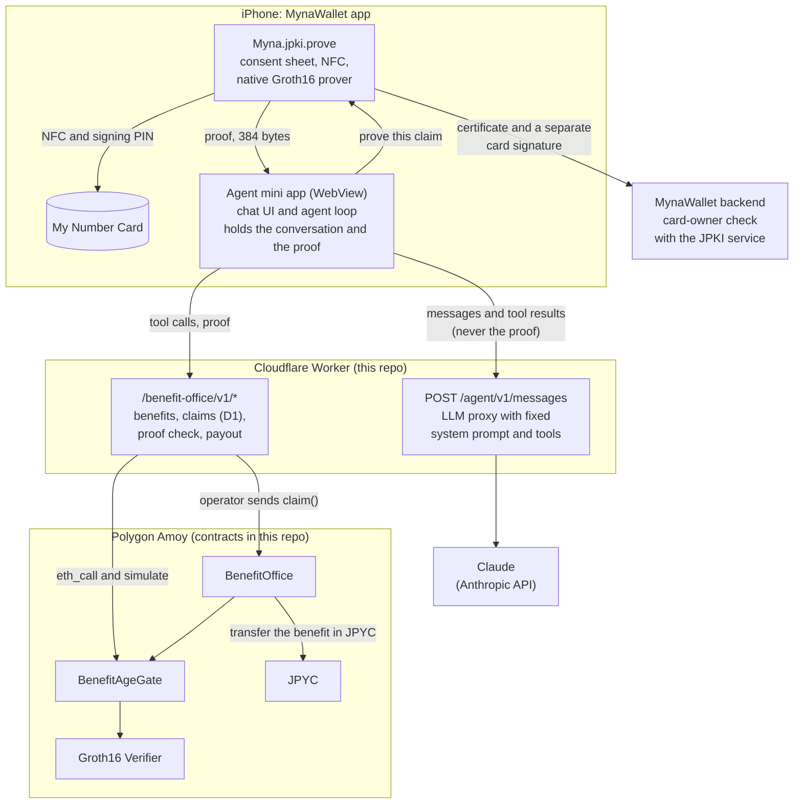
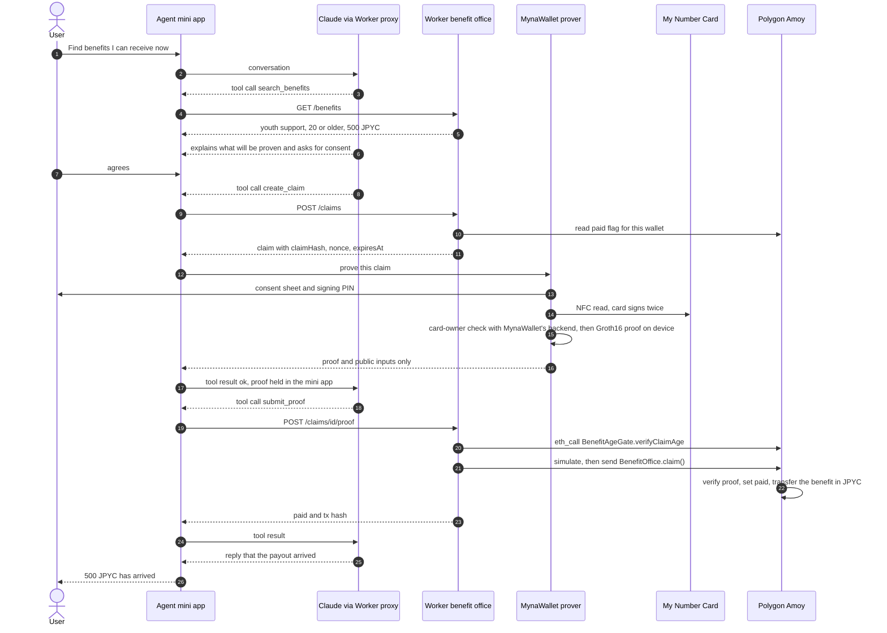

# Myna Agent

**An AI agent in MynaWallet that finds government benefits you can receive and claims them for you, proving with your My Number Card that you are 20 or older without revealing your birth date, and receiving the payout in JPYC after the proof is verified on-chain.**

- **Live:**
  - The contracts are on Polygon Amoy (chain id 80002). For example, the [benefit office the demo uses](https://amoy.polygonscan.com/address/0xe83485cb12bc6e6ed4a5b4b016afe119da5a55b2) shows each payout.
  - The Worker is deployed. For example, [the benefits it offers](https://benefit-office.ethglobal2026.workers.dev/benefit-office/v1/benefits?lang=en) returns JSON. The Worker's root URL has no page and answers 404.
- **An agent-driven payout on Amoy:** [`0x8287b5fd…8d33`](https://amoy.polygonscan.com/tx/0x8287b5fd955ab2ad4cd5e894595a9cfebdb4bd27e4bd873327bc46a8e8708d33). The agent's `submit_proof` led to one `claim()` that verified the proof and paid 500 JPYC.

This repository holds the hackathon code for ETHGlobal Tokyo 2026: the benefit office contracts, the Groth16 verifier, and the Cloudflare Worker that serves the agent and the benefit office API.

## What it does

1. In the MynaWallet app, the user opens the agent mini app and asks: "Find benefits I can receive now."
2. The agent (Claude, through tools) searches a demo benefit office and finds a benefit that requires the recipient to be 20 or older.
3. The agent explains what will be proven and asks for consent. The user agrees.
4. The agent creates a claim. The benefit office issues a challenge bound to this benefit, this wallet and this office.
5. MynaWallet shows its own consent sheet and reads the user's physical My Number Card over NFC. After the user enters the signing PIN, the card signs twice:
   - for MynaWallet's backend, which checks with the JPKI service that the card is valid and belongs to the logged-in user;
   - over the claim's challenge.

   The phone then generates a zero-knowledge proof of "20 or older" locally. The benefit office, the agent and the chain receive only the proof. They never see the birth date, the certificate or the card signature.
6. The agent submits the proof. The benefit office contract on Polygon Amoy verifies it and pays the benefit in JPYC to the user's wallet in the same transaction. The office registers each benefit and its amount in the contract, and the demo benefit pays 500 JPYC.
7. The contract refuses a second claim for the same benefit from the same wallet.

The agent, the mini app and the wallet work in English and Japanese.

Japan's government plans to let people use AI agents with the My Number Card, connecting AI to administrative systems (priority plan approved by the Cabinet on 2026-07-21, [CNET Japan](https://japan.cnet.com/article/35250805/)). About 104.5 million people, 84.3% of the population, hold a My Number Card (end of August 2026, [Ministry of Internal Affairs and Communications](https://www.soumu.go.jp/main_content/001090345.pdf)). This demo shows what such an agent can do while disclosing only what the office needs.

## How the agent acts on-chain

The agent acts for the user on the chain, but a contract, not the agent's prompt, enforces the rules it acts under.

| What the agent does | How Myna Agent does it | Where |
| --- | --- | --- |
| **Acts on-chain** | The agent's `submit_proof` tool makes the Worker send `BenefitOffice.claim()`. That transaction verifies the proof and transfers the benefit's amount in JPYC. [Example](https://amoy.polygonscan.com/tx/0x8287b5fd955ab2ad4cd5e894595a9cfebdb4bd27e4bd873327bc46a8e8708d33). | [`worker/src/agent.ts`](worker/src/agent.ts) (tools), [`worker/src/app.ts`](worker/src/app.ts) (`POST /benefit-office/v1/claims/:id/proof`), [`worker/src/payout.ts`](worker/src/payout.ts), [`contracts/src/BenefitOffice.sol`](contracts/src/BenefitOffice.sol) |
| **Reads chain state first** | The Worker reads the chain before each step that commits anything:<br>• `create_claim` refuses before any card is read if the office already records a payout for this wallet.<br>• `submit_proof` asks `BenefitAgeGate.verifyClaimAge` with `eth_call`, then simulates `claim()`, and sends only if both pass.<br>• A failure comes back to the agent as a named reason, such as `CLAIM_ALREADY_PAID` or `OFFICE_FUNDS_LOW`, which its prompt explains to the user. | [`worker/src/app.ts`](worker/src/app.ts), [`worker/src/verify.ts`](worker/src/verify.ts), [`worker/src/payout.ts`](worker/src/payout.ts) |
| **Stays within policy** | The agent holds no key, no funds, no proof and no personal data. The operator key that sends the transaction can only call `claim()`.<br>The contract decides whether to pay:<br>• once per wallet for each benefit<br>• only with a proof bound to this office, benefit, wallet and amount<br>• only inside the proof's 15-minute window<br>• only for a card under a trust root pinned in the gate<br>• only through the verifier code pinned in the gate | [`contracts/src/BenefitOffice.sol`](contracts/src/BenefitOffice.sol), [`contracts/src/BenefitAgeGate.sol`](contracts/src/BenefitAgeGate.sol) |
| **Reads the chain as its own tool** (not live yet) | We implemented and tested two more agent tools on the Worker: `check_eligibility` (the registered amount, the office balance and the paid flag, read on chain) and `verify_payment` (the receipt and the JPYC `Transfer` log of the payout). They are switched off with `AGENT_ONCHAIN_TOOLS = "false"` until the mini app can run them ([#24](https://github.com/a42x/ETHGlobalTokyo2026/issues/24)). The demo does not use them. | [`worker/src/onchain.ts`](worker/src/onchain.ts), `GET /benefit-office/v1/onchain/eligibility`, `GET /benefit-office/v1/claims/:id/onchain` |

### Where to look in the code

The links are pinned to commit `b225434`, so the line numbers stay valid.

| What the agent does | What the code does | Code |
| --- | --- | --- |
| Acts on-chain | The agent's tools, including `submit_proof` | [`worker/src/agent.ts` L103–L155](https://github.com/a42x/ETHGlobalTokyo2026/blob/b2254345e7f75873bc518df35baf939e684ae955/worker/src/agent.ts#L103-L155) |
| Acts on-chain | `submit_proof` on the Worker: check the proof with the gate, send `claim()`, wait for the receipt | [`worker/src/app.ts` L180–L279](https://github.com/a42x/ETHGlobalTokyo2026/blob/b2254345e7f75873bc518df35baf939e684ae955/worker/src/app.ts#L180-L279) |
| Acts on-chain | Simulate `claim()`, then send it from the operator key | [`worker/src/payout.ts` L86–L136](https://github.com/a42x/ETHGlobalTokyo2026/blob/b2254345e7f75873bc518df35baf939e684ae955/worker/src/payout.ts#L86-L136) |
| Reads chain state first | Refuse a claim the chain already paid, before any card is read | [`worker/src/app.ts` L110–L117](https://github.com/a42x/ETHGlobalTokyo2026/blob/b2254345e7f75873bc518df35baf939e684ae955/worker/src/app.ts#L110-L117) |
| Reads chain state first | Ask `BenefitAgeGate.verifyClaimAge` with `eth_call` | [`worker/src/verify.ts` L27–L38](https://github.com/a42x/ETHGlobalTokyo2026/blob/b2254345e7f75873bc518df35baf939e684ae955/worker/src/verify.ts#L27-L38) |
| Reads chain state first | Turn a reverted simulation into a reason the agent can explain | [`worker/src/payout.ts` L51–L66](https://github.com/a42x/ETHGlobalTokyo2026/blob/b2254345e7f75873bc518df35baf939e684ae955/worker/src/payout.ts#L51-L66) |
| Reads chain state first | The agent's instructions, including what to say for each failure code | [`worker/src/agent.ts` L34–L47](https://github.com/a42x/ETHGlobalTokyo2026/blob/b2254345e7f75873bc518df35baf939e684ae955/worker/src/agent.ts#L34-L47) |
| Stays within policy | The LLM proxy: the system prompt and the tools are fixed on the server | [`worker/src/agent.ts` L290–L301](https://github.com/a42x/ETHGlobalTokyo2026/blob/b2254345e7f75873bc518df35baf939e684ae955/worker/src/agent.ts#L290-L301) |
| Stays within policy | `BenefitOffice.claim()`: operator only, once per wallet for each benefit, recompute `claimHash`, verify through the gate, pay JPYC | [`contracts/src/BenefitOffice.sol` L76–L94](https://github.com/a42x/ETHGlobalTokyo2026/blob/b2254345e7f75873bc518df35baf939e684ae955/contracts/src/BenefitOffice.sol#L76-L94) |
| Stays within policy | `BenefitAgeGate`: pinned verifier code hash, claim binding, time window, pinned trust roots | [`contracts/src/BenefitAgeGate.sol` L22–L57](https://github.com/a42x/ETHGlobalTokyo2026/blob/b2254345e7f75873bc518df35baf939e684ae955/contracts/src/BenefitAgeGate.sol#L22-L57) |
| Reads the chain as its own tool (not live yet) | Tool definitions, the chain reader, and the two endpoints | [`worker/src/agent.ts` L198–L221](https://github.com/a42x/ETHGlobalTokyo2026/blob/b2254345e7f75873bc518df35baf939e684ae955/worker/src/agent.ts#L198-L221), [`worker/src/onchain.ts` L47–L99](https://github.com/a42x/ETHGlobalTokyo2026/blob/b2254345e7f75873bc518df35baf939e684ae955/worker/src/onchain.ts#L47-L99), [`worker/src/app.ts` L150–L178](https://github.com/a42x/ETHGlobalTokyo2026/blob/b2254345e7f75873bc518df35baf939e684ae955/worker/src/app.ts#L150-L178) |

The agent loop that runs these tools in the browser is in the agent mini app (a42x/miniapp-playground, private). It keeps the proof out of the conversation.

## Architecture



One claim, end to end:



The proof never enters the conversation. The LLM sees the conversation, tool names and tool results. The proof goes from the wallet to the mini app, to the Worker and on to the chain. For a proof, the LLM sees only `{ ok, proof_type, proof_ref: "held" }`.

| Part | Where | What |
| --- | --- | --- |
| Contracts | [`contracts/`](contracts/) | `BenefitAgeGate` (binds the proof to the claim, checks time and root key) and `BenefitOffice` (verifies through the gate, pays JPYC once per wallet for each benefit). Foundry. |
| Verifier | [`zk-age-verifier/`](zk-age-verifier/) | Groth16 verifier generated from the age circuit's verifying key, with deployment and verification scripts. |
| Worker | [`worker/`](worker/) | Cloudflare Worker (Hono, viem, D1). Benefit office API, the proof check and payout, the on-chain reads, and the LLM proxy for the agent. |
| Agent mini app | a42x/miniapp-playground (private), deployed at <https://miniapp-playground.web.app/agent/> | Chat UI and the browser-side agent loop that runs the tools. Falls back to a scripted agent when the LLM is unavailable. |
| Wallet | MynaWallet app (a42x/mynawallet-mobile, private; development build) | `Myna.jpki.prove`: consent sheet, NFC, card-owner check, certificate checks and the native prover. |

## Technical highlights

**A government PKI signature, proven in zero knowledge on a phone.** The `jpki_age` circuit (Noir) proves all of the following, revealing none of the certificate:
- The card's signing certificate is signed by a J-LIS root (RSA-2048, SHA-256).
- The certificate follows the J-LIS signing profile and is valid for the claim window.
- The card's key signed `"ZeroKeyMate age authentication v1\0" || claimHash || nonce`.
- The birth date makes the holder 20 or older at the reference time, counted in Japan time.

ProveKit's Groth16 backend runs natively on the iPhone as a Rust library behind an Expo module. On an iPhone 16 Pro, proving took about 12.4 s in a single observation, and the proof is 384 bytes.

**The proof is bound to one on-chain action.** The card signs the claim hash and a nonce issued by the office. `BenefitOffice` recomputes `claimHash = keccak256(abi.encode(chainId, office, benefitId, recipient, amount, 20))` itself, so a proof made for one wallet, benefit, office or chain fails for any other. It is also valid only inside its 15-minute window. The card signs only after its signing PIN is entered, so each proof also shows that the card and its PIN were used for this exact claim.

**The agent decides; it does not hold anything.** The LLM chooses tools, but:
- The Worker fixes the system prompt and the tool list, so a client cannot add tools.
- The mini app runs the tools and keeps the proof out of the conversation.
- The transaction is sent by an operator key that can only call `claim()`.
- The contract alone decides whether to pay.

**Verify and pay in one transaction.** `claim()` checks the paid flag, has the gate verify the proof, sets the flag and transfers JPYC, all in one transaction. If any step fails, nothing moves. One claim costs about 669,000 gas, of which proof verification is about 370,000.

**Trust anchors are constants in bytecode.**
- The gate compiles in the SHA-256 of each accepted root key's modulus. No caller, admin or server can add a trust root at runtime.
- One circuit accepts both production cards and JPKI test cards. The root a gate pins, not a flag in the proof, decides which it accepts. The J-LIS gate accepts only the two production roots, so a test card's proof fails there.
- The gate also pins the verifier's code hash.
- We compared the deployed bytecode of the gates and offices with the source at commit `1b6d87d`, and it matched.

**Read the chain before spending gas, and say why when it fails.**
- The Worker checks the paid flag before issuing a challenge, so nobody reads a card for a claim that cannot pay.
- Before sending, it verifies the proof with `eth_call` and simulates `claim()`.
- Reverts and node errors become named codes the agent can explain: `CLAIM_ALREADY_PAID`, `OPERATOR_FUNDS_LOW`, `OFFICE_FUNDS_LOW`, `PAYOUT_MISCONFIGURED` or `PAYOUT_FAILED`.

**Card-owner binding without a new API.** In the same NFC session, the card makes a second signature for MynaWallet's existing eKYC check. That check has the JPKI service verify the certificate, including revocation, and compares the card holder with the logged-in user. Someone else's card is stopped before any proof is made. This runs in the app and MynaWallet's backend, not on-chain.

Details, measurements and trust assumptions: [docs/submission-zk.md](docs/submission-zk.md).

## Deployed on Polygon Amoy (chain id 80002)

| Contract | Address |
| --- | --- |
| `BenefitOffice` (test My Number Cards; the Worker uses this one) | [`0xe83485cb12bc6e6ed4a5b4b016afe119da5a55b2`](https://amoy.polygonscan.com/address/0xe83485cb12bc6e6ed4a5b4b016afe119da5a55b2) |
| `BenefitAgeGateJpkiTest` (JPKI-TEST roots) | [`0x70bc454c84536f05934051ba7b7bb91e3c368588`](https://amoy.polygonscan.com/address/0x70bc454c84536f05934051ba7b7bb91e3c368588) |
| `BenefitOffice` (real My Number Cards) | [`0x946105a8d563c70be8d6b8682047e9064878c885`](https://amoy.polygonscan.com/address/0x946105a8d563c70be8d6b8682047e9064878c885) |
| `BenefitAgeGate` (J-LIS roots) | [`0x44a0c9187cacfd2211d6e36e662b81e21950fdee`](https://amoy.polygonscan.com/address/0x44a0c9187cacfd2211d6e36e662b81e21950fdee) |
| Groth16 Verifier | [`0x8b87ccb35a5f90f4ff963bf4b1bd6551a0aac078`](https://amoy.polygonscan.com/address/0x8b87ccb35a5f90f4ff963bf4b1bd6551a0aac078) |
| JPYC | [`0xE7C3D8C9a439feDe00D2600032D5dB0Be71C3c29`](https://amoy.polygonscan.com/address/0xE7C3D8C9a439feDe00D2600032D5dB0Be71C3c29) |

MynaWallet's development backend is connected to the JPKI test environment, so its wallets are registered with test cards, and the Worker points at the test-card office. The same circuit and verifier are designed to accept real cards too (the real-card office uses a gate that pins the production J-LIS roots), but no real card has claimed through the v2 verifier yet. Which environment a proof belongs to is decided by the root key each gate pins.

Example payouts with a test card and the current verifier, both to the test-card office:

| Run | Transaction |
| --- | --- |
| Through the agent: mini app, Worker, `claim()` | [`0x8287b5fd…8d33`](https://amoy.polygonscan.com/tx/0x8287b5fd955ab2ad4cd5e894595a9cfebdb4bd27e4bd873327bc46a8e8708d33) |
| An earlier run to the same wallet | [`0x6c877a40…1ec9`](https://amoy.polygonscan.com/tx/0x6c877a40f71bc08bccb8bb9da36d1fba25512501490d6fdd4661df22df761ec9) |

The runs with a real card used the first verifier, before it accepted test cards. Their claim transactions are on the pages of the offices of that time, [`0x91F11e24…2Bd0`](https://amoy.polygonscan.com/address/0x91F11e24Fd60c654814EEF71BFB9d267B61e2Bd0) and [`0xdD042C51…d104`](https://amoy.polygonscan.com/address/0xdD042C51Ae39902C1C49b9c1D28BA1B0Ce74d104). All deployments, including the retired ones, are in [`contracts/deployments/amoy.json`](contracts/deployments/amoy.json).

The Worker is deployed at `https://benefit-office.ethglobal2026.workers.dev`. It is an API, and its root URL has no page. To see it answer, open [`GET /benefit-office/v1/benefits?lang=en`](https://benefit-office.ethglobal2026.workers.dev/benefit-office/v1/benefits?lang=en) or [`GET /health`](https://benefit-office.ethglobal2026.workers.dev/health).

## Setup and testing

You need Node.js 22 or later and [Foundry](https://getfoundry.sh/) (`forge` and `anvil`).

**Contracts**

```sh
cd contracts
forge install foundry-rs/forge-std@v1.11.0 --no-git
forge test
```

**Verifier**

```sh
cd zk-age-verifier
npm ci
npm test                 # deploys to a local anvil with a throwaway key and checks valid and tampered proofs
npm run verify:dry-run   # checks against Amoy with an eth_call state override; deploys nothing
```

**Worker**

```sh
cd worker
npm ci
npm run typecheck
npm test                 # some tests call the public Amoy RPC
```

To run it locally, create `worker/.dev.vars` (git-ignored) with `ANTHROPIC_API_KEY` and `OPERATOR_PRIVATE_KEY`, then:

```sh
npm run db:migrate:local
npx wrangler dev
```

Without `OPERATOR_PRIVATE_KEY` the Worker refuses to pay (`PAYOUT_MISCONFIGURED`, 503). Other payout failures come back as `OPERATOR_FUNDS_LOW`, `OFFICE_FUNDS_LOW` or `PAYOUT_FAILED` with a reason, and are logged. Without `ANTHROPIC_API_KEY` the agent route answers `503`, and the mini app falls back to a scripted agent.

## Known limitations

- The Groth16 setup was run by a single party and is not audited. Certificate revocation is not checked by the proof.
- The contract cannot tell whether the card belongs to the wallet's owner. Before proving, the wallet asks MynaWallet's backend, which checks the card with the JPKI service (revocation included) against the user's identity record, and stops if the card is someone else's (a42x/mynawallet-mobile#812, private). This check runs in the app and the backend, not on-chain. For it, the signing certificate and a separate card signature go to MynaWallet's backend. The benefit office never receives them.
- The agent's own on-chain read tools (`check_eligibility`, `verify_payment`) are implemented on the Worker but switched off until the mini app runs them ([#24](https://github.com/a42x/ETHGlobalTokyo2026/issues/24)).
- iOS only, Polygon Amoy testnet only. The owner can clear a paid flag (`resetPaid`) to retake the demo.

See [docs/submission-zk.md](docs/submission-zk.md) for the full list.

## Team

We are the team behind [MynaWallet](https://x.com/MynaWallet) ([@MynaWallet](https://x.com/MynaWallet)).

| Member | Role | Handles |
| --- | --- | --- |
| Yoshitaka Shindo | Product manager. Worker, agent and agent mini app | GitHub [@shindyu](https://github.com/shindyu) |
| Susumu Tomita | ZK age proof, contracts and verifier | GitHub [@susumutomita](https://github.com/susumutomita), X [@tonitoni415](https://x.com/tonitoni415) |
| Hiroyuki Tachibana | Developer | X [@7pastelblackcat](https://x.com/7pastelblackcat) |
| Wataru Shinohara | Developer | GitHub [@wshino](https://github.com/wshino), X [@shinanonozenji_](https://x.com/shinanonozenji_) |

## Secrets (this repository is public)

Never commit:

- API keys (such as `ANTHROPIC_API_KEY`), private keys, or RPC URLs that contain keys.
- Anything from a real card: certificates, signatures, birth dates, or proofs made with a real card.
- Internal server settings or host names.

Put secrets in Cloudflare with `wrangler secret put`, and locally in `.dev.vars`. The Foundry deploy key is kept in an environment variable and passed to `forge script --private-key` on the command line; it is never written to a file in this repository. The operator is a demo-only account. Before pushing, check:

```sh
git diff --cached | grep -iE 'sk-ant|PRIVATE_KEY=|0x[0-9a-f]{64}'
```

## Prior work and what we built during the hackathon

Built before the hackathon (Continuity):
- **MynaWallet** (the wallet app, its backend and the mini app SDK) is our team's existing product.
- **ZeroKeyMate** was built earlier by a team member (Susumu Tomita). It is the source of the `jpki_age` circuit, the native prover runtime and the age gate design.

Built during the hackathon (2026-09-25 to 09-26):
- `BenefitOffice`, `BenefitAgeGate` (adapted from ZeroKeyMate's `MateAgeGate` for Polygon Amoy), and the gates for test cards and synthetic data.
- The change to the circuit's signing-policy check so that it also accepts JPKI-TEST cards ([`d24fafc`](https://github.com/susumutomita/ZeroKeyMate/commit/d24fafc97ac11c50e46ff240fb3d08ea82143a73)), and the proving key and verifier built from it.
- The Worker: the benefit office API, the LLM proxy, the chain reads and the payout.
- The agent mini app.
- In MynaWallet: `Myna.jpki.prove` (consent sheet, NFC, TypeScript witness builder, native prover bridge) and the card-owner check.

[`docs/2026-09-25-benefit-office-worker-and-contracts.md`](docs/2026-09-25-benefit-office-worker-and-contracts.md) is the plan we wrote at the start (in Japanese). This README and [docs/submission-zk.md](docs/submission-zk.md) describe what was actually built.

## Attribution and license

The age circuit (`jpki_age`), the ProveKit Groth16 backend setup and the age gate design come from [susumutomita/ZeroKeyMate](https://github.com/susumutomita/ZeroKeyMate) (Apache-2.0). ProveKit is by the World Foundation (MIT, see `zk-age-verifier/PROVEKIT-LICENSE.md`). This repository is Apache-2.0 ([`LICENSE`](LICENSE)). The proving system is an experimental branch with a single-party setup; use it for demos only.
